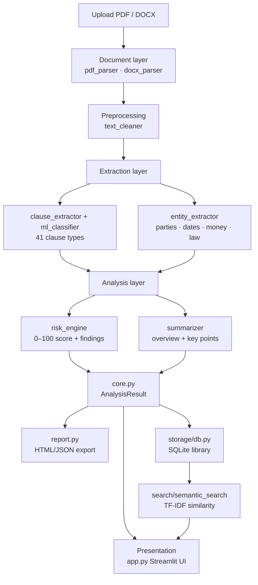

# ClauseLens — Project Documentation

**A complete, from-scratch explanation of the Legal Contract Analyzer: what it does, how it is built, and *why* each technical and design decision was made.**

> ClauseLens is an AI-assisted contract-review tool. Upload a PDF or Word contract and it reads the document, identifies each clause, extracts the key terms (parties, dates, money, governing law), scores the legal risk, writes a plain-English summary, and makes every clause searchable — turning hours of manual review into a structured, minutes-long first pass.

---

## Table of contents

1. [The problem](#1-the-problem)
2. [What ClauseLens does](#2-what-clauselens-does)
3. [Design philosophy](#3-design-philosophy)
4. [System architecture](#4-system-architecture)
5. [Technology stack — and why](#5-technology-stack--and-why)
6. [How it works, stage by stage](#6-how-it-works-stage-by-stage)
7. [The machine-learning model in depth](#7-the-machine-learning-model-in-depth)
8. [Design & UX decisions](#8-design--ux-decisions)
9. [Security engineering](#9-security-engineering)
10. [Testing](#10-testing)
11. [Results & performance](#11-results--performance)
12. [Challenges & solutions](#12-challenges--solutions)
13. [Running locally](#13-running-locally)
14. [Deployment](#14-deployment)
15. [Project structure](#15-project-structure)
16. [Future enhancements](#16-future-enhancements)

---

## 1. The problem

Reviewing a commercial contract is slow, repetitive, and error-prone. A reviewer has to:

- read pages of dense boilerplate to find the handful of clauses that carry risk,
- pull out the commercial facts (who, when, how much, under whose law),
- notice not just risky terms that *are* present, but protective terms that are *missing*,
- and do all of this consistently across dozens or hundreds of documents.

The cost is real: review is a bottleneck in sales, procurement, and due diligence, and fatigue on "page 40" is exactly where mistakes happen. ClauseLens was built to remove the mechanical first pass so a human can spend their time on judgement.

**Goal:** an accurate, fast, private, and genuinely useful contract analyzer — not a toy demo, but something that could be deployed and used to solve this real problem.

---

## 2. What ClauseLens does

| Capability | Description |
|---|---|
| **Document ingestion** | Reads PDF and DOCX contracts and extracts clean text. |
| **Clause classification** | Labels each section as one of **41 clause types** (indemnity, limitation of liability, governing law, termination, …) using a trained ML model. |
| **Entity extraction** | Pulls out parties, effective date, term, governing law, monetary amounts, and notice periods. |
| **Risk analysis** | Produces a **0–100 risk score** and ranked findings from risky clauses present, protective clauses missing, and red-flag language. |
| **Plain-English summary** | Generates a fact-based overview and an extractive key-points summary. |
| **Semantic search** | Finds similar clauses across the whole library — precedents, comparisons, reusable language. |
| **Library & reporting** | Saves analyses, shows portfolio analytics, and exports a branded HTML report or JSON. |
| **Learn section** | Flashcards and articles that teach the underlying contract concepts. |

---

## 3. Design philosophy

Four principles drove every decision:

1. **Accuracy over hype.** Use the simplest technique that does the job well. A well-tuned classical ML model that we can measure, explain, and trust beats a large model we can't.
2. **Privacy by architecture.** No contract text is sent to any third-party service at analysis time. The whole pipeline runs in-process, which also makes it cheap and deterministic.
3. **Deterministic and explainable.** The same contract always produces the same result, and every risk finding cites the clause it came from — essential for a legal tool.
4. **Deployable, not just a notebook.** Lean dependencies, a committed model artifact, and a real UI so it can be shipped to a URL and used.

---

## 4. System architecture

ClauseLens is a layered, modular monolith. Each layer is a small, independently testable Python package under `src/`, and `core.py` orchestrates them.



**Why a layered monolith and not microservices?** For a single-analyst tool, network boundaries would add latency, deployment complexity, and failure modes for zero benefit. Clean module boundaries give us the testability and separation of concerns that matter, without the operational tax.

---

## 5. Technology stack — and why

This is the heart of the project's engineering story. Every choice was deliberate.

### Language: Python 3.13
The whole NLP/ML ecosystem lives in Python, and it keeps the training pipeline and the app in one language.

### UI: Streamlit
- **Why:** turns Python directly into an interactive, data-rich web app — charts, file upload, tables, state — with no separate front-end codebase, and it deploys free on Streamlit Community Cloud.
- **Rejected:** Flask/FastAPI + React would mean building and maintaining a separate SPA, an API layer, and a build pipeline — weeks of work for a UI Streamlit gives in one file. For a data tool with one primary user flow, that complexity isn't justified.

### Clause classification: scikit-learn — TF-IDF + Logistic Regression
This is the most important decision in the project.

- **Why classical ML instead of Legal-BERT / a transformer?**
  - **Size & deployability:** the entire model artifact is a few MB and loads instantly. A transformer stack (PyTorch + `transformers` + model weights) is hundreds of MB to gigabytes — too heavy for a free Streamlit deployment and slow to cold-start.
  - **Speed:** TF-IDF + Logistic Regression classifies a whole contract in milliseconds on CPU. No GPU required.
  - **Explainability & determinism:** linear models are transparent and give the same answer every time.
  - **It's good enough — measurably.** On the CUAD test set it reaches **77.1% accuracy** and **0.70 macro-F1** across 41 classes, versus a **16.2%** majority/keyword baseline — roughly a **4.8×** lift. That accuracy is more than enough for a first-pass triage tool. (Pushing past ~85% would require a transformer such as Legal-BERT, at ~100× the size and cost and with new failure modes — a trade rejected for a private, free, CPU-only deployment.)
  - **The trade-off we accepted:** a transformer would likely score higher on subtle clauses, at 100× the size and cost. For a deployable, private, CPU-only tool, that trade is not worth it. This is documented honestly rather than hidden.
- **Model selection:** we compared candidates during training and **Logistic Regression** was selected on validation macro-F1 (over e.g. linear SVM / naive Bayes variants). A **confidence threshold (0.15)** suppresses low-confidence guesses, and a **15-type keyword baseline** acts as a transparent fallback when the model is off or unavailable.

### Training data: CUAD (Contract Understanding Atticus Dataset)
- **Why:** CUAD is the standard, expert-annotated public dataset for contract clause understanding — 41 clause categories labelled by legal professionals. It gives the model real, legally-grounded supervision. Trained on **10,901** examples, evaluated on **1,368**.

### Entity extraction: rule-based (regex + heuristics)
- **Why not an NER model?** The entities we need — parties, dates, monetary amounts, governing law, notice periods — follow highly regular patterns in contracts. Precise rules are **more accurate and fully explainable** here than a general-purpose NER model, with zero inference cost and no training data required.

### Risk analysis: rule-based engine
- **Why:** legal risk scoring must be **auditable**. The engine combines (a) high-risk clauses present, (b) protective clauses *absent*, and (c) red-flag language, into a 0–100 score where every finding cites its evidence. A black-box risk score would be unacceptable in a legal context.

### Summarization: extractive, fact-based (no LLM)
- **Why not a generative LLM?** Generative summaries can **hallucinate** terms that aren't in the contract — dangerous for legal review. Our summary is assembled only from **extracted, verified facts** (parties, dates, clauses, risk), so it can never invent a clause. It also keeps the tool private and free.

### Storage: SQLite
- **Why:** a single-file, zero-configuration, embedded database — perfect for a self-contained app. It needs no server, deploys with the app, and handles the library comfortably. Postgres would add infrastructure for scale we don't yet need; the storage layer is isolated in one module so it can be swapped later.

### Semantic search: TF-IDF cosine similarity
- **Why:** consistent with the classifier's representation, instant, and dependency-free. It finds clauses by meaning-overlap without needing an embedding service or vector database.

### Charts: Plotly
- **Why:** interactive, publication-quality charts (risk gauge, donuts, distributions) that theme cleanly and render natively in Streamlit.

### The deliberate absence of an LLM
Not using an LLM at analysis time is a **feature**, not a limitation. It makes ClauseLens private (no data leaves the process), free to run, instant, deterministic, and immune to prompt-injection and hallucination — the exact properties a legal tool needs.

---

## 6. How it works, stage by stage

1. **Ingest** — `document/` extracts text from PDF (`pdfplumber`) or DOCX (`python-docx`). Scanned image-only PDFs are detected and flagged (there is no OCR step).
2. **Clean** — `preprocessing/text_cleaner` normalizes whitespace, strips page markers, and repairs common extraction artifacts. A security pass normalizes Unicode, strips control characters, and caps length.
3. **Segment & classify** — `extraction/clause_extractor` splits the text into sections by headings, and `ml_classifier` labels each with one of 41 clause types (with a keyword fallback).
4. **Extract entities** — `extraction/entity_extractor` pulls parties, dates, money, governing law, term, and notice periods with targeted rules.
5. **Score risk** — `analysis/risk_engine` evaluates risky clauses present, protective clauses missing, and red-flag language → a 0–100 score with ranked, evidence-cited findings.
6. **Summarize** — `analysis/summarizer` builds a plain-English overview and an extractive key-points list from the verified facts.
7. **Assemble** — `core.py` returns a single `AnalysisResult` dataclass that the UI, report, and storage all consume.
8. **Persist & search** — `storage/db` saves to SQLite; `search/semantic_search` builds a TF-IDF index over all stored clauses for similarity search.

---

## 7. The machine-learning model in depth

- **Task:** multi-class classification of a clause's text into one of 41 CUAD categories.
- **Features:** a union of **word (1–2 gram) and character (3–5 gram) TF-IDF** vectors — char n-grams add robustness to legal morphology, hyphenation and minor OCR noise, and measurably lift balanced accuracy.
- **Model:** Logistic Regression (class-balanced), selected over a calibrated Linear SVC on validation macro-F1.
- **Data:** CUAD — 10,901 training clauses, 1,368 test clauses.
- **Results (held-out test set):**
  - Accuracy **77.1%**
  - Macro-F1 **0.704**, Weighted-F1 **0.755**
  - Baseline (majority/keyword) accuracy **16.2%** → **~4.8× improvement**
  - Ceiling note: a transformer (Legal-BERT) could push accuracy higher, but at a size/cost/latency that breaks the free, private, CPU-only deployment — so it was deliberately not used.
- **Confidence threshold (0.15):** below this, the model abstains rather than guess, and the clause is shown as "unclassified" — better to say "not sure" than to be confidently wrong.
- **Keyword fallback (15 types):** a transparent baseline used when the model is disabled or unavailable, so the app always works.
- **Deployment:** the trained model is committed as `models/clause_classifier.joblib` and `scikit-learn` is pinned (`==1.9.0`) so the artifact unpickles reliably on the deploy target.

---

## 8. Design & UX decisions

- **Palette:** deep **navy (#0f2a4a)** + **gold (#c9a227)** — the colors of law and institutions (courts, seals, legal publishing). Pure white was deliberately avoided as it reads as unfinished. A soft slate background adds depth.
- **Typography:** *Playfair Display* (a serif) for headings to signal authority and tradition; *Inter* for body text for clarity.
- **Iconography:** a consistent professional icon system — Google Material Symbols in the navigation and clean line-style SVG icons in cards — no emoji, which read as unprofessional in a serious tool. A custom scales-of-justice emblem serves as the brand mark.
- **Motion:** subtle, purposeful animation (fade/float on load, hover lift on cards, a pulse on high-risk findings, 3D flip on flashcards) — polish without distraction.
- **Information architecture:** six focused pages — Dashboard (outcomes and portfolio analytics), Analyze, Library, Find Clauses, Learn, About — with a persistent, single-line, left-aligned navigation.
- **Copy:** written in plain, professional, human language focused on outcomes ("Review contracts in minutes, not hours"), not technical jargon.

---

## 9. Security engineering

Because contracts contain sensitive data and the app renders text from untrusted files, security was engineered in from the start (see [`SECURITY.md`](../SECURITY.md)):

- **No XSS / HTML injection:** every value derived from a document is HTML-escaped before rendering.
- **No SQL injection:** all database queries are parameterized.
- **Upload validation:** files are checked by size, extension, and magic bytes before any parser touches them, blocking spoofed or oversized files.
- **No LLM attack surface:** with no generative model in the loop, prompt-injection has nowhere to land.
- **Input hardening:** untrusted text is Unicode-normalized, control-character stripped, and length-capped.

These controls are mapped to the OWASP Web and LLM Top 10 in `SECURITY.md` and covered by a dedicated test suite.

---

## 10. Testing

**73 automated tests** cover the whole system:

- document parsing and text cleaning,
- clause classification and entity extraction,
- the risk engine and summarizer,
- storage and semantic search,
- the end-to-end pipeline on a real contract,
- and **security** (XSS/HTML-injection escaping, SQL-injection resistance, and file-upload validation).

Run them with `pytest tests/ -q`.

---

## 11. Results & performance

- **Clause classifier:** 77.1% accuracy / 0.70 macro-F1 across 41 types (vs 16.2% baseline).
- **Speed:** a full contract — parse, classify, extract, score, summarize — completes in seconds on CPU, with no network calls.
- **Footprint:** a few-MB model and a lean dependency set that installs and cold-starts quickly on free hosting.
- **Verified end to end** on real contracts (e.g. a multi-page agreement: 33 sections, 28 clauses identified, risk scored).

---

## 12. Challenges & solutions

| Challenge | Solution |
|---|---|
| CUAD's official HuggingFace loader is broken | Load the dataset directly from the Atticus GitHub `data.zip` in the offline training script. |
| Legal text is dense and irregularly formatted | Heading-based segmentation + robust text cleaning + a confidence threshold so weak guesses abstain. |
| Keeping a transformer's accuracy without its weight | Tuned word+char TF-IDF + Logistic Regression to 77% and accepted the honest trade-off for a deployable, private, CPU-only tool. |
| Rendering untrusted contract text safely | Central escaping (`src/security.py`) applied everywhere the UI emits HTML. |
| Model must unpickle on the deploy target | Pin `scikit-learn==1.9.0` and commit the artifact. |
| Search results going stale after edits | Cache the search index on `(contracts, clauses)` so it rebuilds on any library change. |

---

## 13. Running locally

```bash
python -m venv venv
venv\Scripts\activate            # Windows  (source venv/bin/activate on macOS/Linux)
pip install -r requirements.txt
streamlit run app.py
```

Then open <http://localhost:8501> and try the sample in `sample_contracts/`.

---

## 14. Deployment

1. Push the repository to GitHub.
2. On **Streamlit Community Cloud**, create an app pointing at `app.py` (Python 3.13).
3. The trained model is committed, so the app runs immediately with no extra setup.

---

## 15. Project structure

```
legal-contract-analyzer/
├── app.py                     # Streamlit UI (presentation layer)
├── src/
│   ├── core.py                # Pipeline orchestrator → AnalysisResult
│   ├── report.py              # Branded HTML/JSON report
│   ├── security.py            # Escaping, upload validation, input hardening
│   ├── document/              # pdf_parser, docx_parser
│   ├── preprocessing/         # text_cleaner
│   ├── extraction/            # clause_extractor, entity_extractor, ml_classifier
│   ├── analysis/              # risk_engine, summarizer
│   ├── search/                # semantic_search (TF-IDF)
│   ├── storage/               # db (SQLite)
│   └── content/               # education (flashcards + articles)
├── models/                    # committed clause_classifier.joblib
├── tests/                     # 73 tests
├── sample_contracts/          # demo contract
├── docs/                      # this documentation + case study
├── SECURITY.md                # threat model & OWASP mapping
└── requirements.txt
```

---

## 16. Future enhancements

- OCR for scanned PDFs.
- Multi-user authentication with per-user contract isolation.
- Playbook comparison (benchmark a contract against a company's standard positions).
- Clause redlining suggestions.
- Optional, privacy-preserving LLM layer for negotiation drafting (kept out of the analysis path).

---

## 17. State management, caching & performance

- **Session state:** the current analysis and its signature (`analysis`, `analysis_sig`, `saved_id`) live in `st.session_state`; the active page lives in `st.session_state.nav`. Re-analysis only runs when the upload signature changes, so navigating between tabs never re-processes the document.
- **Dashboard freshness:** all dashboard and sidebar figures are read **live** from SQLite on every rerun (`db.list_contracts`, `db.count_contracts`, `db.get_all_clauses`) — there are no hardcoded or cached dashboard numbers, so counts, charts, and the library always reflect the true state after a save or delete.
- **Search index caching:** the TF-IDF search index is cached with `@st.cache_resource` keyed on `(contract_count, clause_count)`, so it rebuilds automatically whenever the library changes — but not on every rerun.
- **Model loading:** the `joblib` model is loaded once and reused; classification is milliseconds on CPU.
- **No wasteful reruns:** actions that change data (`save`, `delete`) call `st.rerun()` once; there are no rerun loops.

## 18. Interview explanations

**A. 30-second version**
> ClauseLens is an AI-assisted legal contract analyzer. You upload a PDF or Word contract and it identifies the clauses, extracts the key terms, scores the risk out of 100, and writes a plain-English summary — turning hours of manual review into a minutes-long first pass. I built it in Python with scikit-learn and Streamlit, and I deliberately used a lightweight, explainable ML model instead of a large language model so it's private, instant, and deployable for free.

**B. 2-minute version**
> Contract review is slow and error-prone — reviewers wade through boilerplate to find the few clauses that carry risk. ClauseLens automates that first pass. It parses the document, splits it into sections, and a machine-learning model I trained on the CUAD dataset labels each section as one of 41 clause types at about 77% accuracy. Rule-based extractors pull out parties, dates, money, and governing law, and a rule-based engine scores risk from risky clauses present, protective clauses missing, and red-flag language — every finding citing its evidence. It then writes a fact-based summary and makes every clause searchable. The key engineering decision was to avoid an LLM: classical TF-IDF + Logistic Regression is a few MB, runs on CPU in milliseconds, is fully explainable, and can't hallucinate a clause — exactly what a legal tool needs. It's covered by 73 tests and hardened against the OWASP Web and LLM Top 10.

**C. 5-minute technical version**
> Walk through the layered architecture (document → preprocessing → extraction → analysis → presentation/storage/search, orchestrated by `core.py`). Explain the model: word+char TF-IDF features feeding a class-balanced Logistic Regression, selected over a calibrated Linear SVC on validation macro-F1, trained on 10,901 CUAD clauses and reaching 77.1% accuracy / 0.70 macro-F1 versus a 16.2% baseline, with a 0.15 confidence threshold and a keyword fallback. Cover the deliberate absence of an LLM and why (privacy, determinism, no hallucination, cost, no prompt-injection surface). Cover the rule-based entity and risk layers and why rules beat models for regular, auditable outputs. Cover the deployment story (committed model, pinned scikit-learn, Streamlit Cloud) and the security controls. Close with honest limitations (imbalanced classes, no OCR, single-tenant) and the roadmap.

## 19. Interview questions & answers

- **Why Streamlit, not React/FastAPI?** For a single-flow data tool, Streamlit turns Python into an interactive app with no separate front-end, API, or build pipeline, and deploys free. React/FastAPI would be the right call for a multi-tenant production SaaS — that's on the roadmap, not needed for this scope.
- **Why not use an LLM?** Privacy (no data leaves the process), determinism, no hallucinated clauses, no prompt-injection surface, instant CPU inference, and zero per-call cost. For legal review, explainability and traceability matter more than a few points of accuracy.
- **Why classical ML / how does clause classification work?** Clause text → word (1–2) + char (3–5) TF-IDF vectors → class-balanced Logistic Regression over 41 CUAD classes, with a confidence threshold so weak predictions abstain.
- **How is risk calculated?** A transparent rule-based engine: risky clauses present + protective clauses missing + red-flag phrases → a 0–100 score with evidence-cited findings. It's decision-support, not a legal judgement.
- **How are PDFs processed?** `pdfplumber` for PDF text, `python-docx` for DOCX; scanned image-only PDFs are detected and flagged (no OCR step).
- **How does the dashboard stay in sync?** Every figure is read live from SQLite each rerun; nothing is hardcoded. Save/delete trigger a single rerun.
- **What happens when the model is wrong?** The confidence threshold suppresses weak guesses (shown as "unclassified"), the keyword baseline backs it up, and the UI + disclaimer make clear it's decision-support requiring human review.
- **What are the limitations?** ~77% accuracy on imbalanced 41-class data; ambiguous/unusual contracts; no OCR; single shared library without auth; rule-based risk is heuristic.
- **How would you scale it / reach higher accuracy?** Add authentication and per-user isolation, move storage to Postgres, split into an API + React front-end, and — for accuracy — fine-tune Legal-BERT with a GPU-backed inference service (accepting the cost/privacy trade-offs).
- **How do you secure legal documents?** Output escaping (no XSS), parameterized SQL, magic-byte upload validation, input hardening, no third-party calls; mapped to OWASP Web/LLM Top 10 and tested.

---

*ClauseLens provides automated analysis to accelerate contract review. It is a decision-support tool and does not replace advice from a qualified attorney.*
